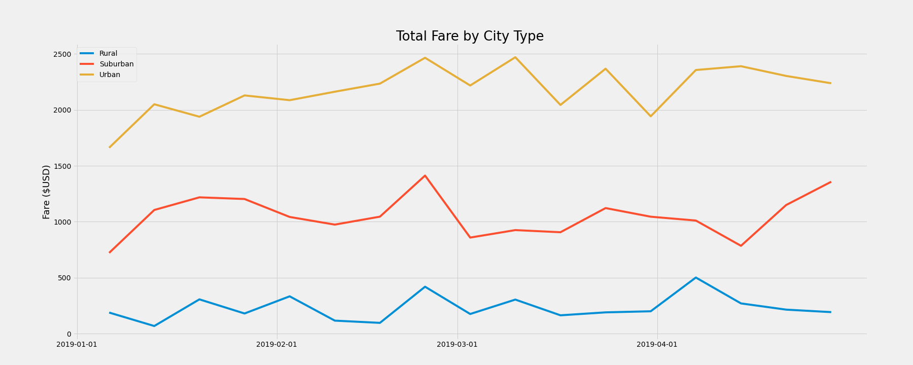

# pyber_analysis
---
## Overview of the Analysis
### The purpose of this analysis is to create a summary that is easily readable and presentable to help show the differences between city type for the total weekly fares of PyBer. To do this, I compared the number of fares in each of the city types provided which were urban, suburban, and rural. Then I created a plot with matplotlib in order to show the differences between the city types. 
---
## Results
The summary below shows the number of total rides, total drivers, total fares, average fare per ride, and average fare per driver for each of the city types. 

Some differences we can see between city types are:
- There are about 13 times more rides in urban compared to rural cities. 
- There are about 31 times more drivers in urban compared to rural cities. 
- The total number of fares in dollars goes up by about 9 times for urban cities compared to rural ones. 
- The average fare per ride goes down as the population scales up, with the lowest cost being in urban areas and the highest cost being in rural areas. 
- The average fare per driver goes up as the population goes down, with the most expensive average fare per driver being in rural areas and the least expensive average fare per driver being in urban areas.
---
## Summary 

In addressing the disparities among the city types, I would recommend reducing the number of drivers in urban cities because this was the only city type to have more drivers than the number of rides. This doesn't seem very economical. I would also look into this because the average fare per driver for urban cities is almost 3.5 times lower than the average fare per driver in rural areas. If the company were to look into how long these drives were, it would also give us more information to see what kind of mileage drivers can expect to drive for the fare price. Theoretically, urban cities would have more traffic to get through and longer fare times than rural areas per distance. I might recommend to the company to look at this data of distance and time in order to make sure urban drivers were compensated as fairly as rural drivers. 
